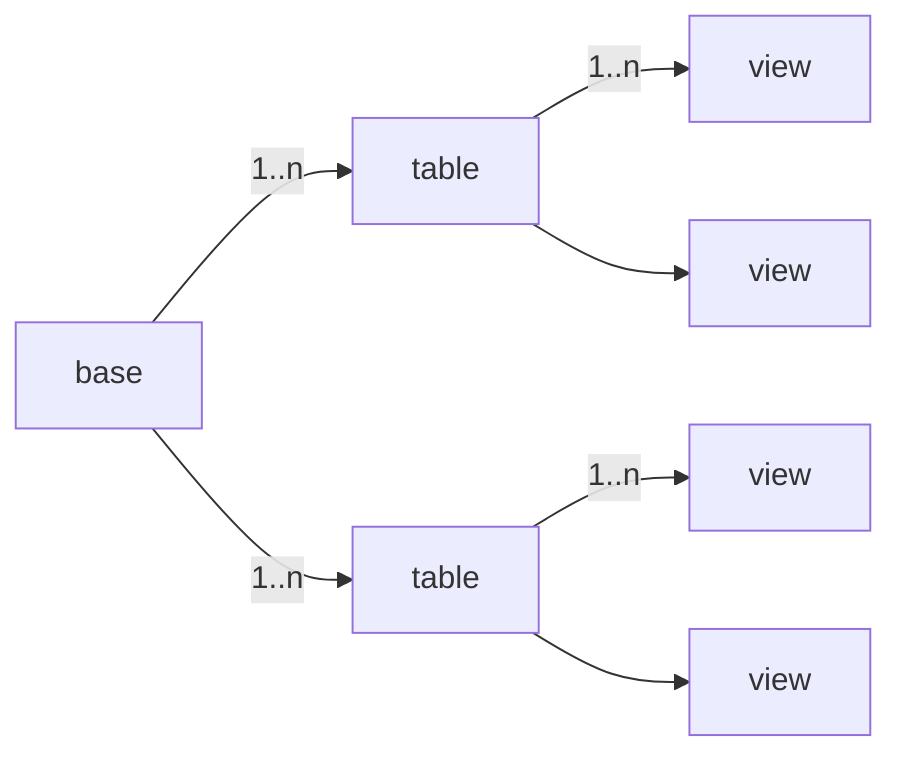

# NocoDB

智能数据表工具使用分享

<!-- 

  结合芯片验证场景，让测试表格、BugList、ChangeList 集中且可追溯，助力验证流程提效 <carbon:arrow-right />

 -->

  <button @click="$slidev.nav.openInEditor()" title="Open in Editor" class="slidev-icon-btn">
    <carbon:edit />
  </button>
  <a href="https://github.com/Freedyool/sharing" target="_blank" class="slidev-icon-btn">
    <carbon:logo-github />
  </a>

---

# 目录

<Toc minDepth="1" maxDepth="1" />

---

# NocoDB：Airtable 的开源替代品

将 MySQL、PostgreSQL、SQLite 转换为智能电子表格。

---
layout: two-cols-header
---

# NocoDB 基本概念

::left ::

- field（字段）：表格的列名
- record（记录）：表格的数据行
- base（项目）：若干张表格的集合
- table（表格）：用于数据存储的容器
- view（视图）：用于数据可视化的交互媒介

::right::

---

# NocoDB 视图创建

内置 Grid/Kanban/Gallery/Form/Calendar 五种视图

---

# NocoDB 权限管理

- 系统权限：组织浏览者 / 组织创建者
- 项目权限：所有者 / 创建者 / 编辑者 / 评论者 / 浏览者和无访问权限

---

## NocoDB 项目权限

权限速览表

| 角色 | 浏览数据 | 添加评论 | 编辑数据 | 编辑视图 | 锁定视图 | 编辑字段 | 创建表格 | 管理权限 |
| --- | --- | --- | --- | --- | --- | --- | --- | --- |
| 所有者 | ✔ | ✔ | ✔ | ✔ | ✔ | ✔ | ✔ | ✔ |
| 创建者 | ✔ | ✔ | ✔ | ✔ | ✔ | ✔ | ✔ | ❌ |
| 编辑者 | ✔ | ✔ | ✔ | ✔ | ❌ | ❌ | ❌ | ❌ |
| 评论者 | ✔ | ✔ | ❌ | ❌ | ❌ | ❌ | ❌ | ❌ |
| 浏览者 | ✔ | ❌ | ❌ | ❌ | ❌ | ❌ | ❌ | ❌ |

---

# 案例：BK7239N 芯片验证流程

让测试表格、BugList、ChangeList 集中串联，助力验证流程提效

  

    <figure class="text-center">
      
      <figcaption class="text-xs mt-1 opacity-70">7239N芯片验证</figcaption>
    </figure>
    <figure class="text-center">
      
      <figcaption class="text-xs mt-1 opacity-70">7239N数据表关联</figcaption>
    </figure>
  

  
* 缩略图尺寸裁剪显示，点击查看原始清晰度 *

---
layout: end
---

# 问题反馈与现场讨论

- 关于使用问题：可将问题填写在 README 项目的问题反馈表中
- 关于访问性问题：如遇浏览器报 500，可尝试找 IT 升级浏览器
